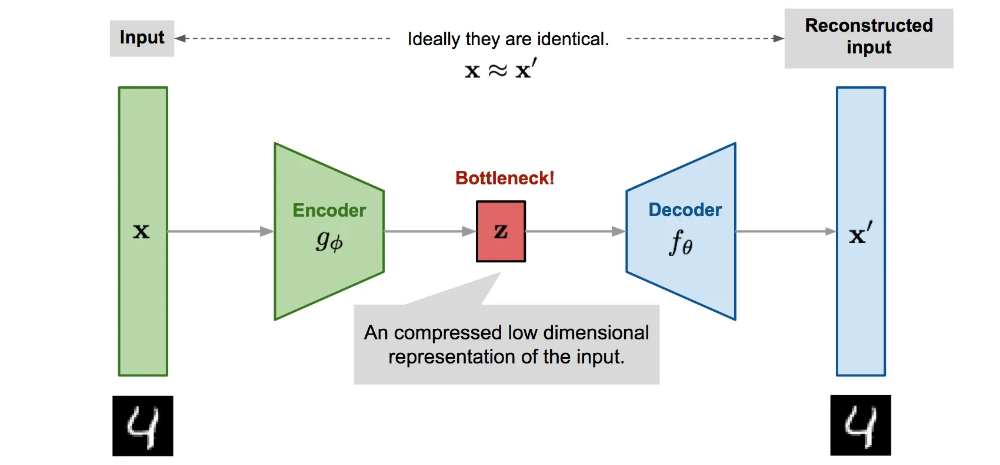

1. Anomaly Detection  
In this question, we will try 4 different methods to do the `anomaly detection` task.  
You need determine your threshold to differentiate MNIST and Fashion-MNIST.
    * Dataset: MNIST、Fashion-MNIST  

Method descriptions:  
* Classifier: similar to classification task.
* Autoencoder: use `MSE` to justify the difference.   
(note that the 2 data distribution should be different enough)
* Denoising Autoencoder: trained with noised image, try to get the original image without noisy.   
(Actually same as Autoencoder)
* Random Forest: decision tree

2. Autoencoder training progress
    * Autoencoder: an image do a compression (encoder), then decompression (decoder), last you can get the images

[ref](https://medium.com/ml-note/autoencoder-%E4%B8%80-%E8%AA%8D%E8%AD%98%E8%88%87%E7%90%86%E8%A7%A3-725854ab25e8)  
    * variational autoencoder (VAE): Based on Autoencoder, but connected with `probability distribution`.  

3. GAN and related-GAN model training progress  
    * illustrated with two clusters of 2D data  

In question 1, GAN has more good result that can generate similar cluster data as the example data shown.  
That doesn't mean WGAN and WGAN-GP are bad because I didn't train very well when using this 2 models.